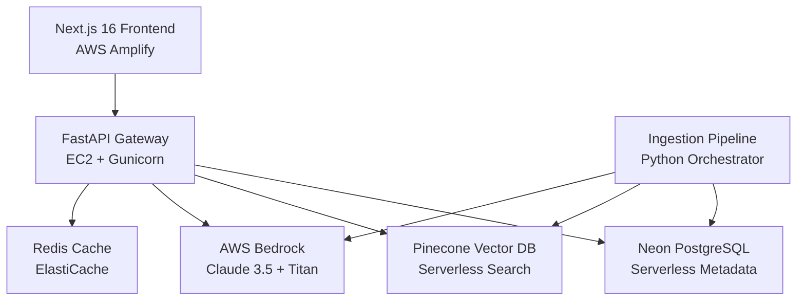

# 🇮🇳 Dev-Store: AI for Bharat

**Empowering Indian developers with intelligent, RAG-powered resource discovery**

*An AI-first marketplace that transforms how developers discover, evaluate, and integrate APIs, models, and datasets through context-aware search with multilingual support for English, Hindi, and Hinglish.*

---

## 🚀 Tech Stack


**Frontend:** Next.js 16 (App Router) • TypeScript • Tailwind CSS • NextAuth  
**Backend:** FastAPI • Python 3.11 • Pydantic • Mangum (Lambda)  
**AI/ML:** AWS Bedrock (Claude 3.5 Sonnet) • Titan Embeddings v2  
**Database:** Neon (Serverless PostgreSQL) • Pinecone (Serverless Vector Store)  
**Infrastructure:** AWS Amplify • EC2 • Redis • S3  

---

## ✨ Key Features

### 🎯 **Dual-Layer Filtering**
Advanced search combining SQL metadata filtering (category, pricing, popularity) with vector similarity ranking. SQL filters narrow the dataset, then vector search ranks by semantic relevance.

### 🤖 **RAG-Powered Chat Assistant**
Context-aware AI assistant using AWS Bedrock Claude 3.5 Sonnet that understands developer intent and provides personalized resource recommendations with code examples.

### 📊 **Multi-Source Ingestion Pipeline**
Automated data pipeline ingesting from:
- **GitHub:** 654+ repositories and developer tools
- **HuggingFace:** 1,100+ ML models and datasets  
- **Kaggle:** 40+ structured datasets
- **OpenRouter:** 346+ LLM models with pricing

### ⚖️ **Score Normalization Engine**
Custom ranking algorithm normalizing scores across different platforms using composite metrics: relevance, popularity, optimization, and freshness with unified `rank_score` computation.

### 🌐 **AI for Bharat Mission**
Native support for English, Hindi, and Hinglish queries with intelligent language detection and culturally-aware response matching for India's 5M+ developers.

---

## 🏗️ Architecture

**Serverless-First Approach** with hybrid deployment strategy:



**Key Design Decisions:**
- **Frontend:** Amplify for global CDN and auto-scaling
- **Backend:** EC2 for cost optimization with reserved instances  
- **Database:** Neon for serverless PostgreSQL with connection pooling
- **Vector Store:** Pinecone for sub-100ms semantic search
- **AI:** Bedrock for enterprise-grade LLM access
- **Cache:** Redis for distributed locks and embedding cache

---

## 📂 Project Structure

```
dev-store-ai-bharat/
├── backend/                    # FastAPI backend
│   ├── main.py                # Application entry point
│   ├── api_gateway.py         # EC2 deployment gateway
│   ├── config.py              # Configuration management
│   ├── clients/               # AWS Bedrock & Database clients
│   ├── routers/               # API route handlers
│   │   ├── search.py          # Dual-layer search endpoint
│   │   ├── rag.py             # RAG chat assistant
│   │   ├── resources.py       # Resource management
│   │   └── auth.py            # Authentication
│   ├── services/              # Business logic
│   │   ├── search.py          # Search orchestration
│   │   ├── embeddings.py      # Vector operations
│   │   └── ranking.py         # Score normalization
│   ├── models/                # Pydantic data models
│   ├── ingestion/             # Multi-source pipeline
│   │   ├── orchestrator_production.py  # Main pipeline
│   │   ├── fetchers/          # Source-specific harvesters
│   │   ├── services/          # Chunking, embedding, ranking
│   │   ├── stages/            # Atomic pipeline stages
│   │   └── INGESTION_GUIDE.md # Pipeline documentation
│   ├── migrations/            # Database schema
│   └── tests/                 # Test suite
├── frontend/                  # Next.js 16 frontend
│   ├── app/                   # App Router pages
│   ├── components/            # React components
│   │   └── DevStoreDashboard.jsx  # Main dashboard
│   ├── lib/                   # API client utilities
│   └── auth.ts                # NextAuth configuration
├── docs/                      # Documentation
└── .kiro/specs/               # Feature specifications
```

---

## 🚀 Quick Start

### 1️⃣ **Clone & Setup**
```bash
git clone https://github.com/your-org/dev-store-ai-bharat.git
cd dev-store-ai-bharat
```

### 2️⃣ **Environment Configuration**
```bash
# Backend
cp backend/.env.example backend/.env
# Frontend  
cp frontend/.env.local.example frontend/.env.local
# Configure your API keys (see .env files for details)
```

### 3️⃣ **Start Development**
```bash
# Terminal 1 - Backend
cd backend && pip install -r requirements.txt
uvicorn main:app --reload --port 8000

# Terminal 2 - Frontend
cd frontend && npm install && npm run dev

# Or use the convenience script
./start_all.sh
```

**🌐 Access:** Frontend at `http://localhost:3000` • API docs at `http://localhost:8000/docs`

---

## 🚀 Deployment

### **Production Architecture**
- **Frontend:** AWS Amplify with global CDN (configured via `amplify.yml`)
- **Backend:** EC2 with Application Load Balancer (see `backend/deploy.sh`)
- **Database:** Neon PostgreSQL with connection pooling
- **Monitoring:** Custom health checks and systemd services

### **Deployment Commands**
```bash
# Frontend (Amplify auto-deploys on push)
git push origin main

# Backend (EC2 deployment)
cd backend && ./deploy.sh
```

---

## 📊 Performance Metrics

- **Search Latency:** <200ms average response time
- **Vector Search:** Sub-100ms with Pinecone serverless optimization
- **Pipeline Throughput:** 10-15 resources/sec (Bedrock embedding limited)
- **Full Sync:** 3-5 minutes for 2,500+ resources
- **Scale:** Optimized for 100K+ resource tier

---

## 🛠️ API Endpoints

| Endpoint | Method | Description |
|----------|--------|-------------|
| `/api/v1/search` | POST | Dual-layer semantic search (SQL + Vector) |
| `/api/v1/rag/chat` | POST | RAG-powered AI assistant |
| `/api/v1/resources` | GET | Resource listing with filters |
| `/api/v1/resources/{id}` | GET | Resource details with metadata |
| `/api/v1/health` | GET | System health and metrics |

---

## 🔄 Ingestion Pipeline

Run the automated multi-source ingestion:

```bash
cd backend

# Production pipeline (requires AWS credentials)
python ingestion/run_production.py

# Development pipeline (JSON output only)
python ingestion/run_ingestion.py
```

**Pipeline Stages:** Fetch → Normalize → Deduplicate → Upsert (Neon) → Embed (Bedrock) → Upsert (Pinecone) → Rank → Cache

See [`backend/ingestion/INGESTION_GUIDE.md`](backend/ingestion/INGESTION_GUIDE.md) for detailed documentation.

---

## 🏆 Built for AI4 Bharat Hackathon

**Team Dev-Store-AI-Bharat:**
- **Mohd Arsh** - AI/ML Engineering (RAG, Embeddings, Multilingual)
- **Raunak** - Data Engineering (Pipelines, Infrastructure, Monitoring)  
- **Vansh** - Frontend Engineering (UI/UX, Performance, Accessibility)
- **Aryan** - Backend Engineering (APIs, DevOps, Architecture)

---

## 📚 Documentation

- [🔧 Backend Setup Guide](backend/README.md)
- [🤖 RAG System Documentation](backend/RAG_SYSTEM_GUIDE.md)
- [📊 Ranking Algorithm Details](backend/RANKING_FEATURES.md)
- [🔄 Ingestion Pipeline Guide](backend/ingestion/INGESTION_GUIDE.md)
- [🚀 EC2 Deployment Guide](backend/README_EC2.md)

---

## 📄 License

Apache License 2.0 - Built with ❤️ for the Indian developer community

---

<div align="center">

**[🌐 Live Demo](https://main.d2goix7t3vcz9c.amplifyapp.com)** • **[📖 API Docs](http://localhost:8000/docs)** 


</div>