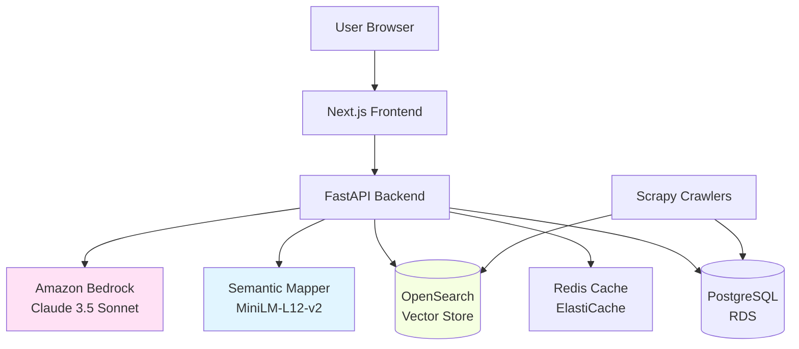
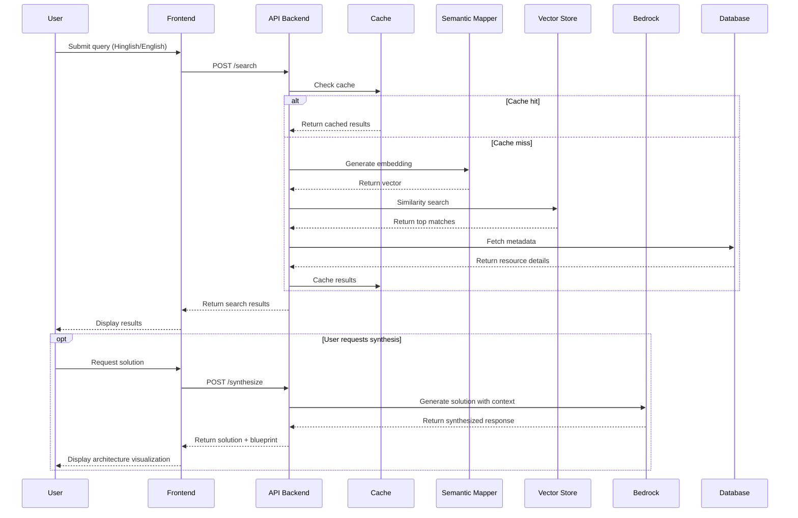
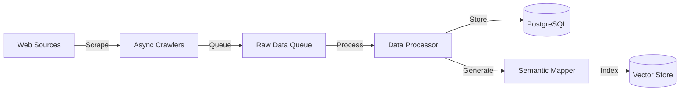

# Design Document: Dev-Store

## Overview

The Dev-Store is a RAG-based discovery platform that enables Indian developers to search for APIs, datasets, and AI models using natural language queries in English and Hinglish. The system combines semantic search, intelligent crawling, and AI-powered solution synthesis to provide a comprehensive developer resource discovery experience.

### Key Innovations

1. **Hinglish RAG Search**: Fine-tuned paraphrase-multilingual-MiniLM-L12-v2 model trained on university B200 cluster infrastructure to understand code-mixed Hindi-English technical queries
2. **Semantic Vector Search**: Amazon OpenSearch-based vector storage for similarity-based retrieval
3. **Intelligent Solution Synthesis**: Amazon Bedrock (Claude 3.5 Sonnet) for generating contextual recommendations and code examples
4. **Architecture Visualization**: React Flow-based interactive blueprints showing how resources integrate

### Technology Stack

- **AI/ML**: Fine-tuned paraphrase-multilingual-MiniLM-L12-v2 (trained on B200 cluster), Amazon Bedrock (Claude 3.5 Sonnet)
- **Search**: Amazon OpenSearch (vector storage and retrieval)
- **Backend**: FastAPI (async API), Scrapy (async crawlers), PostgreSQL (Amazon RDS), Redis (Amazon ElastiCache)
- **Frontend**: Next.js, React Flow
- **Infrastructure**: AWS (OpenSearch, RDS, ElastiCache, Bedrock)

## Architecture

### High-Level Architecture



### Component Interaction Flow



### Data Flow Architecture



## Components and Interfaces

### 1. Semantic Mapper (Fine-tuned MiniLM-L12-v2)

**Purpose**: Convert text queries and resource descriptions into semantic vectors for similarity search.

**Training Details**:
- Base model: paraphrase-multilingual-MiniLM-L12-v2
- Training infrastructure: University B200 GPU cluster
- Training data: English, Hindi, and Hinglish technical queries paired with relevant resources
- Fine-tuning objective: Contrastive learning to maximize similarity between queries and relevant resources

**Interface**:
```python
class SemanticMapper:
    def __init__(self, model_path: str):
        """Load fine-tuned model from path"""
        
    def encode_query(self, query: str) -> np.ndarray:
        """
        Convert user query to semantic vector
        Args:
            query: User search query in English or Hinglish
        Returns:
            384-dimensional embedding vector
        """
        
    def encode_resource(self, resource: Resource) -> np.ndarray:
        """
        Convert resource metadata to semantic vector
        Args:
            resource: Resource object with title, description, tags
        Returns:
            384-dimensional embedding vector
        """
        
    def batch_encode(self, texts: List[str]) -> np.ndarray:
        """Encode multiple texts efficiently"""
```

**Implementation Notes**:
- Model produces 384-dimensional embeddings
- Supports batch encoding for efficiency
- Handles code-mixed Hinglish text through multilingual training
- Normalizes embeddings for cosine similarity

### 2. Vector Store (Amazon OpenSearch)

**Purpose**: Store and retrieve resource embeddings using vector similarity search.

**Configuration**:
- Index: `dev-store-resources`
- Vector dimension: 384
- Similarity metric: Cosine similarity
- Engine: k-NN with HNSW algorithm

**Interface**:
```python
class VectorStore:
    def __init__(self, opensearch_endpoint: str, index_name: str):
        """Initialize OpenSearch client"""
        
    def index_resource(self, resource_id: str, embedding: np.ndarray, 
                      metadata: Dict[str, Any]) -> bool:
        """
        Store resource embedding with metadata
        Args:
            resource_id: Unique resource identifier
            embedding: 384-dimensional vector
            metadata: Resource metadata for filtering
        Returns:
            Success status
        """
        
    def search(self, query_embedding: np.ndarray, top_k: int = 20,
              filters: Optional[Dict[str, Any]] = None) -> List[SearchResult]:
        """
        Find similar resources using vector search
        Args:
            query_embedding: Query vector
            top_k: Number of results to return
            filters: Optional metadata filters (type, provider, etc.)
        Returns:
            List of search results with similarity scores
        """
        
    def bulk_index(self, resources: List[Tuple[str, np.ndarray, Dict]]) -> int:
        """Bulk index multiple resources"""
        
    def delete_resource(self, resource_id: str) -> bool:
        """Remove resource from index"""
```

**Index Schema**:
```json
{
  "mappings": {
    "properties": {
      "resource_id": {"type": "keyword"},
      "embedding": {
        "type": "knn_vector",
        "dimension": 384,
        "method": {
          "name": "hnsw",
          "space_type": "cosinesimil",
          "engine": "nmslib"
        }
      },
      "resource_type": {"type": "keyword"},
      "provider": {"type": "keyword"},
      "title": {"type": "text"},
      "description": {"type": "text"},
      "tags": {"type": "keyword"},
      "created_at": {"type": "date"}
    }
  }
}
```

### 3. API Backend (FastAPI)

**Purpose**: Provide REST API for search, resource management, and solution synthesis.

**Endpoints**:

```python
from fastapi import FastAPI, HTTPException
from pydantic import BaseModel

app = FastAPI()

class SearchRequest(BaseModel):
    query: str
    top_k: int = 20
    filters: Optional[Dict[str, Any]] = None

class SearchResponse(BaseModel):
    results: List[ResourceResult]
    query_time_ms: float

class SynthesisRequest(BaseModel):
    query: str
    resource_ids: List[str]

class SynthesisResponse(BaseModel):
    solution: str
    blueprint: Dict[str, Any]
    resources_used: List[str]

@app.post("/api/v1/search")
async def search(request: SearchRequest) -> SearchResponse:
    """
    Semantic search for resources
    - Generates query embedding using Semantic Mapper
    - Searches Vector Store for similar resources
    - Fetches metadata from Database
    - Caches results in Redis
    """

@app.post("/api/v1/synthesize")
async def synthesize_solution(request: SynthesisRequest) -> SynthesisResponse:
    """
    Generate AI-powered solution using Bedrock
    - Retrieves resource details from Database
    - Constructs prompt with resource context
    - Calls Amazon Bedrock (Claude 3.5 Sonnet)
    - Generates architecture blueprint
    """

@app.get("/api/v1/resources/{resource_id}")
async def get_resource(resource_id: str) -> Resource:
    """Fetch detailed resource information"""

@app.post("/api/v1/resources")
async def create_resource(resource: ResourceCreate) -> Resource:
    """Add new resource to catalog"""
```

**Async Processing**:
- All I/O operations (DB, cache, vector store) use async/await
- Connection pooling for PostgreSQL and Redis
- Request timeout: 30 seconds
- Concurrent request limit: 1000

### 4. Database (PostgreSQL on RDS)

**Purpose**: Store resource metadata, user data, and system configuration.

**Schema**:

```sql
-- Resources table
CREATE TABLE resources (
    id UUID PRIMARY KEY DEFAULT gen_random_uuid(),
    resource_type VARCHAR(20) NOT NULL CHECK (resource_type IN ('api', 'dataset', 'model')),
    title VARCHAR(255) NOT NULL,
    description TEXT NOT NULL,
    provider VARCHAR(100) NOT NULL,
    documentation_url TEXT,
    created_at TIMESTAMP DEFAULT CURRENT_TIMESTAMP,
    updated_at TIMESTAMP DEFAULT CURRENT_TIMESTAMP,
    metadata JSONB NOT NULL DEFAULT '{}'
);

-- API-specific metadata
CREATE TABLE api_metadata (
    resource_id UUID PRIMARY KEY REFERENCES resources(id) ON DELETE CASCADE,
    base_url TEXT NOT NULL,
    authentication_type VARCHAR(50),
    rate_limit_per_hour INTEGER,
    endpoints JSONB NOT NULL
);

-- Dataset-specific metadata
CREATE TABLE dataset_metadata (
    resource_id UUID PRIMARY KEY REFERENCES resources(id) ON DELETE CASCADE,
    format VARCHAR(50) NOT NULL,
    size_bytes BIGINT,
    update_frequency VARCHAR(50),
    sample_data JSONB
);

-- Model-specific metadata
CREATE TABLE model_metadata (
    resource_id UUID PRIMARY KEY REFERENCES resources(id) ON DELETE CASCADE,
    architecture VARCHAR(100) NOT NULL,
    input_format VARCHAR(100),
    output_format VARCHAR(100),
    performance_metrics JSONB
);

-- Tags for categorization
CREATE TABLE tags (
    id SERIAL PRIMARY KEY,
    name VARCHAR(50) UNIQUE NOT NULL
);

CREATE TABLE resource_tags (
    resource_id UUID REFERENCES resources(id) ON DELETE CASCADE,
    tag_id INTEGER REFERENCES tags(id) ON DELETE CASCADE,
    PRIMARY KEY (resource_id, tag_id)
);

-- Indexes for performance
CREATE INDEX idx_resources_type ON resources(resource_type);
CREATE INDEX idx_resources_provider ON resources(provider);
CREATE INDEX idx_resources_created ON resources(created_at DESC);
CREATE INDEX idx_resource_tags_resource ON resource_tags(resource_id);
```

**Interface**:
```python
class DatabaseClient:
    async def get_resource(self, resource_id: str) -> Optional[Resource]:
        """Fetch resource by ID with all metadata"""
        
    async def search_resources(self, filters: Dict[str, Any]) -> List[Resource]:
        """Search resources by metadata filters"""
        
    async def create_resource(self, resource: ResourceCreate) -> Resource:
        """Insert new resource with metadata"""
        
    async def update_resource(self, resource_id: str, updates: Dict) -> Resource:
        """Update resource metadata"""
        
    async def get_resources_by_ids(self, resource_ids: List[str]) -> List[Resource]:
        """Batch fetch resources"""
```

### 5. Cache Layer (Redis on ElastiCache)

**Purpose**: Cache search results and frequently accessed data for performance.

**Caching Strategy**:
- Search results: TTL 1 hour
- Resource metadata: TTL 24 hours
- User sessions: TTL 7 days

**Interface**:
```python
class CacheClient:
    def __init__(self, redis_url: str):
        """Initialize Redis client with connection pool"""
        
    async def get_search_results(self, query_hash: str) -> Optional[List[Resource]]:
        """Retrieve cached search results"""
        
    async def set_search_results(self, query_hash: str, results: List[Resource], 
                                 ttl: int = 3600) -> bool:
        """Cache search results with TTL"""
        
    async def get_resource(self, resource_id: str) -> Optional[Resource]:
        """Retrieve cached resource metadata"""
        
    async def set_resource(self, resource_id: str, resource: Resource, 
                          ttl: int = 86400) -> bool:
        """Cache resource metadata"""
        
    async def invalidate_pattern(self, pattern: str) -> int:
        """Invalidate cache entries matching pattern"""
```

**Key Patterns**:
- Search: `search:{query_hash}`
- Resource: `resource:{resource_id}`
- User session: `session:{session_id}`

### 6. Crawler Service (Scrapy)

**Purpose**: Automatically discover and collect resource information from web sources.

**Architecture**:
```python
import scrapy
from scrapy.crawler import CrawlerProcess

class ResourceSpider(scrapy.Spider):
    name = "resource_spider"
    
    def __init__(self, source_config: Dict[str, Any]):
        """Initialize spider with source-specific configuration"""
        self.source_config = source_config
        
    async def parse(self, response):
        """
        Parse resource information from web page
        - Extract title, description, provider
        - Identify resource type (API/dataset/model)
        - Extract technical metadata
        - Validate and normalize data
        """
        
class CrawlerService:
    def __init__(self, db_client: DatabaseClient, vector_store: VectorStore,
                 semantic_mapper: SemanticMapper):
        """Initialize crawler with data storage clients"""
        
    async def crawl_source(self, source_name: str) -> CrawlResult:
        """
        Execute crawl job for specific source
        - Run Scrapy spider asynchronously
        - Process collected data
        - Store in database and vector store
        - Return statistics
        """
        
    async def schedule_periodic_crawls(self):
        """Schedule recurring crawl jobs"""
```

**Crawl Sources**:
- GitHub repositories (APIs, models)
- Kaggle datasets
- Hugging Face models
- RapidAPI marketplace
- Custom API directories

**Data Processing Pipeline**:
1. Raw data extraction
2. Validation and normalization
3. Duplicate detection
4. Metadata enrichment
5. Embedding generation
6. Database and vector store insertion

### 7. Reasoning Engine (Amazon Bedrock)

**Purpose**: Generate intelligent solutions and recommendations using Claude 3.5 Sonnet.

**Interface**:
```python
class ReasoningEngine:
    def __init__(self, bedrock_client, model_id: str = "anthropic.claude-3-5-sonnet-20241022-v2:0"):
        """Initialize Bedrock client"""
        
    async def synthesize_solution(self, query: str, resources: List[Resource]) -> Solution:
        """
        Generate solution using retrieved resources
        Args:
            query: Original user query
            resources: Retrieved relevant resources
        Returns:
            Solution with explanation, code examples, and architecture
        """
        
    def _build_prompt(self, query: str, resources: List[Resource]) -> str:
        """
        Construct prompt for Claude with context
        - Include user query (preserve Hinglish if present)
        - Add resource descriptions and metadata
        - Request code examples and integration guidance
        - Ask for architecture recommendations
        """
```

**Prompt Template**:
```
You are an expert developer assistant helping with the AI for Bharat Hackathon.

User Query: {query}

Available Resources:
{resource_list}

Please provide:
1. A clear explanation of how to solve this problem
2. Code examples showing how to use these resources
3. Architecture recommendations for integrating them
4. Any important considerations or best practices

If the query was in Hinglish, acknowledge that and provide a friendly response.
```

**Response Processing**:
- Parse Claude's response
- Extract code blocks
- Generate architecture blueprint data
- Format for frontend display

### 8. Frontend (Next.js)

**Purpose**: Provide intuitive web interface for search and resource discovery.

**Key Pages**:

```typescript
// pages/index.tsx - Home page with search
export default function HomePage() {
  return (
    <Layout>
      <SearchBar onSearch={handleSearch} />
      <FeaturedResources />
      <CategoryBrowser />
    </Layout>
  );
}

// pages/search.tsx - Search results
export default function SearchPage() {
  const { results, loading } = useSearch(query);
  
  return (
    <Layout>
      <SearchBar initialQuery={query} />
      <SearchFilters />
      <ResultsList results={results} />
    </Layout>
  );
}

// pages/resource/[id].tsx - Resource details
export default function ResourcePage() {
  const { resource } = useResource(id);
  
  return (
    <Layout>
      <ResourceHeader resource={resource} />
      <ResourceMetadata resource={resource} />
      <DocumentationSection resource={resource} />
      <SynthesizeButton resourceId={id} />
    </Layout>
  );
}

// pages/solution.tsx - AI-generated solution
export default function SolutionPage() {
  const { solution, blueprint } = useSolution(query, resourceIds);
  
  return (
    <Layout>
      <SolutionExplanation text={solution.explanation} />
      <CodeExamples examples={solution.code} />
      <ArchitectureBlueprint data={blueprint} />
    </Layout>
  );
}
```

**Components**:

```typescript
// components/SearchBar.tsx
interface SearchBarProps {
  onSearch: (query: string) => void;
  initialQuery?: string;
}

export function SearchBar({ onSearch, initialQuery }: SearchBarProps) {
  // Real-time suggestions as user types
  // Support for English and Hinglish
  // Voice input support
}

// components/ArchitectureBlueprint.tsx
import ReactFlow from 'reactflow';

interface BlueprintProps {
  data: {
    nodes: Node[];
    edges: Edge[];
  };
}

export function ArchitectureBlueprint({ data }: BlueprintProps) {
  // Interactive React Flow diagram
  // Node click shows resource details
  // Export as image or JSON
}

// components/ResourceCard.tsx
interface ResourceCardProps {
  resource: Resource;
}

export function ResourceCard({ resource }: ResourceCardProps) {
  // Display resource type badge
  // Show title, description, provider
  // Quick action buttons (view, synthesize)
}
```

**State Management**:
- React Context for global state
- SWR for data fetching and caching
- Local storage for user preferences

## Data Models

### Core Models

```python
from enum import Enum
from typing import Optional, List, Dict, Any
from pydantic import BaseModel, HttpUrl
from datetime import datetime

class ResourceType(str, Enum):
    API = "api"
    DATASET = "dataset"
    MODEL = "model"

class Resource(BaseModel):
    id: str
    resource_type: ResourceType
    title: str
    description: str
    provider: str
    documentation_url: Optional[HttpUrl]
    tags: List[str]
    created_at: datetime
    updated_at: datetime
    metadata: Dict[str, Any]

class APIResource(Resource):
    base_url: HttpUrl
    authentication_type: Optional[str]
    rate_limit_per_hour: Optional[int]
    endpoints: List[Dict[str, Any]]

class DatasetResource(Resource):
    format: str
    size_bytes: Optional[int]
    update_frequency: Optional[str]
    sample_data: Optional[Dict[str, Any]]

class ModelResource(Resource):
    architecture: str
    input_format: str
    output_format: str
    performance_metrics: Optional[Dict[str, Any]]

class SearchResult(BaseModel):
    resource: Resource
    similarity_score: float
    rank: int

class Solution(BaseModel):
    query: str
    explanation: str
    code_examples: List[Dict[str, str]]  # language -> code
    architecture_blueprint: Dict[str, Any]
    resources_used: List[str]
    generated_at: datetime
```

### Vector Store Models

```python
class VectorDocument(BaseModel):
    """Document stored in OpenSearch"""
    resource_id: str
    embedding: List[float]  # 384 dimensions
    resource_type: str
    provider: str
    title: str
    description: str
    tags: List[str]
    created_at: datetime

class SearchQuery(BaseModel):
    """Vector search query"""
    query_text: str
    query_embedding: List[float]
    top_k: int = 20
    filters: Optional[Dict[str, Any]] = None
    min_score: float = 0.3
```

### Blueprint Models

```python
class BlueprintNode(BaseModel):
    """Node in architecture diagram"""
    id: str
    type: str  # "api", "dataset", "model", "component"
    label: str
    resource_id: Optional[str]
    position: Dict[str, float]  # x, y coordinates
    data: Dict[str, Any]

class BlueprintEdge(BaseModel):
    """Edge connecting nodes"""
    id: str
    source: str
    target: str
    label: Optional[str]
    type: str  # "data_flow", "api_call", "dependency"

class ArchitectureBlueprint(BaseModel):
    """Complete architecture visualization"""
    nodes: List[BlueprintNode]
    edges: List[BlueprintEdge]
    layout: str = "dagre"  # Layout algorithm
```

## Data Models

